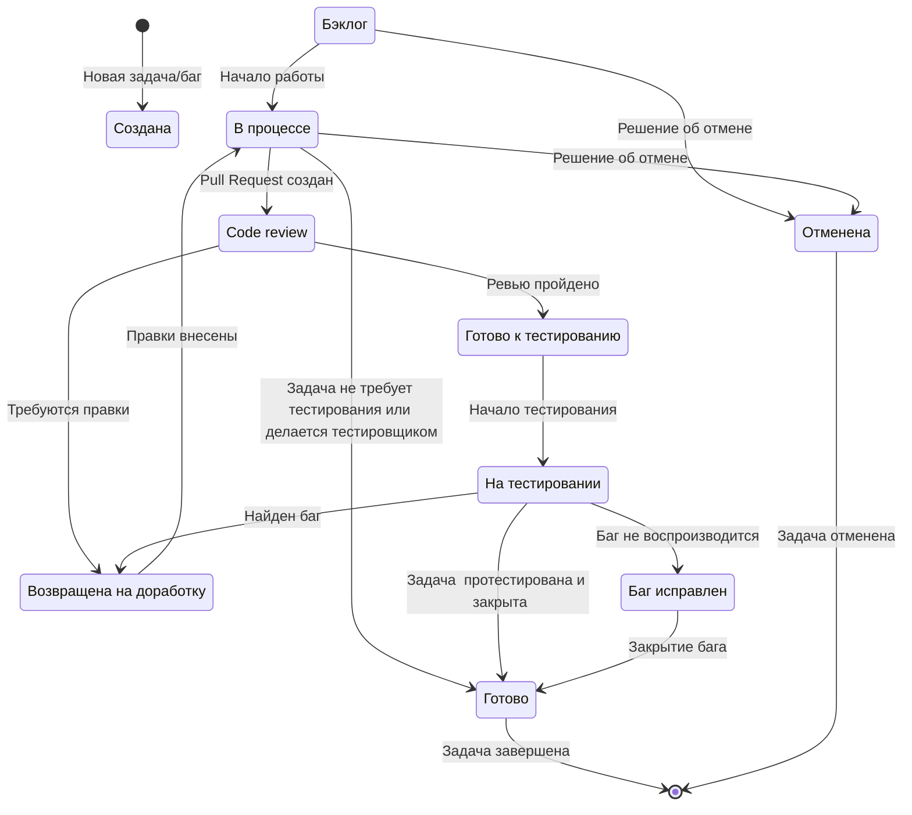

# Ведение документации по проекту

## Содержание:
- [Метки](#метки)
- [Переходы между статусами задач](#переходы-между-статусами-задач)
- [Оформление задач и багов](#оформление-задач-и-багов)

## Метки
### Описание существующих меток
Для создания и движения задач по доске используются следующие метки:
- Задача - метка присваивается при создании задачи
- Баг - присваивается при заведении бага
- Отменена - задача выполнения не требует
- В процессе - работа над задачей уже идёт
- Готово к тестированию - задача сделана и готова к передаче тестировщику
- На тестировании - тестировщик взял задачу в работу
- Готово - задача выполнена
- Возвращена на доработку - необходимо доработать задачу
- Баг исправлен - баг не воспроизводится при повторном тестировании
- Code review - пулл-реквест согласовывают другие разработчики
- Бэклог - задача создана

Для выставления приоритетов используются метки:
- blocking - первый приоритет, баг полностью блокирует функционал
- critical - второй  приоритет, для работы функционала можно  использовать обходной  путь
- high - третий приоритет. Функционал  блокируетсяя частично
- medium - четвёртый приоритет. Функционал не  заблокирован, но влияние на него есть
- low - делать  в последнюю очередь, влияние  на  функционал несущественно

Для понимания, на ком задача, используются  следующие метки:
- Backend - задача для разработчиков внутренней логики приложения
- Analysis - задача на  анатилика
- Test - задача на  тестировщика
- PM - задача для  product-менеджера

## Переходы между статусами задач
Диаграмма переходов задачи  между статусами:

## Оформление задач и багов
### Оформление задачи на тестировщика
Как оформить задачу:
1. Нужно выбрать метки Backlog, Test и Задача
2. В задаче должно быть описано, какой именно функционал должен быть протестирован (как можно подробнее)
3. Нужно указать сроки выполнения задачи
4. В идеале - приложена ссылка на требования
5. Нужно выбрать исполнителя из тестировщиков и указать его
6. Для определения приоритета использовать одну из меток приоритетов

Пример задачи в  GitHub: https://github.com/dalum11/study_cards/issues/16

###  Оформление бага
#### Баги в автотестах
Автотесты, падающие из-за бага,помечаются аннотацией @Disabled
с комментарием. Аннотация убирается  после того, как задача на разработчика
перейдёт в статус Готово

#### Заведение баг-репорта
Для заведения бага в GitHub используется следующий шаблон:

---
Название

Окружение

Описание

Серьёзность

Предварительные условия

Шаги

Ожидаемый результат

Фактический результат

Ссылка на документацию

Файлы

---

Пример оформления бага в GitHub:  https://github.com/dalum11/study_cards/issues/15

Нужно выбрать метку Backlog для новой задачи, метки Backend, Баг и метки приоритета
Необходимо назначить исполнителя. Исполнитель - разработчик, который делал основную  задачу

